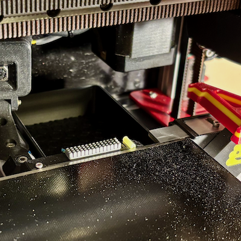

# *** Work in progress ***  Blobifier Modifications

## Description

This is a work in progress and dumping ground for sharing Blobifier modifications to support left and right hand Voron 2.4 installation and concepts for silicon gantry and fixed nozzle wipe / rest options.

The gantry Wipe / Rest design is derived and redrafted based on the excellent work @igannakas (Discord) pioneered to reduce colour contamination when changing and purging filaments during mmu prints. 

## Design Goals

- **Gantry Nozzle Wipe Rest**.

  Redesign to incorporate:
  - Dovetail sliders to make it easier to adjust, reduce mounting hardware and improve rigidity
  - Internal mount and arm voids to improve rigidity - 0.1mm 2x voids (printed parts will always flex to an extent)
  - More material to secure m3 heat sets
  - A1 Mini silicon wiper block. While easier to secure and replace, its smaller and has shorter knobs than the original A1 wiper (zig zag wipe option may help overcome size limitations)
  - Experiment with high temp silicon tubing as nozzle rest with filament pin to secure (Dubro aero/heli silicon fuel tubing - 180c-ish temp). Evaluate 250c silicon syringe and hole plugs from aliexpress as alternatives. Interestingly "most" silicon HE socks are only rated to 280c
  - Additional options to detach filament klingons / blobs before final wipe (e.g. double silicon rest, angled edge and cutaways on mount, etc)  
 
- **Blobifier**
  - Ambidextrous macro logic to handle left and right hand installation (optimise moves based on install orientation e.g. towards and away from Blobifier)
  - Incorporate additional maximum print area bounds checking where it makes sense 
  - Implement Zig zag wiper motion to improve wipe efficacy
  - Customisable nozzle shake option to help detach belligerent blobs (default: off)
  - Customizable tray iterations to help detach belligerent blobs (default: 1)
  - Move servo dwell setting to main Blobifier configuration block
  - Zero and restore PA before / after purging 
  - Support fixed (static) and optional 2.4 gantry mounted nozzle wipe & rest options. Allow use of one or both options
  - Redesign and experiment with fixed wipe and park mount that extends over Blobifier tray to maximise print area
  - Bucket shaker profile for Yavoth hotend
  - Improve depressor pin avoidance logic (base on HH tip cut location and settings if configured)

## MK II Gantry Nozzle Wipe Rest

This is the current design iteration for the 2.4 gantry mounted nozzle wipe rest. Increased material around silicon rest after prelonged parking @ 255c for > 30mins softened and slightly deformed the tubing mount.
Additional rest incorporated as wipe option to help detact small blobs / klingons prior to wiping sequence as they would often get caught and / or picked up subsequently by the nozzle from A1 wiper fingers.

## Yavoth Hotend Shaker Arm

## Videos

Unload, EREC cut, load and blob purge end to end process. Moves havent been fully optimised as yet but have been updated to mostly take the shortest path as the print head transitions from fixed / static nozzle wipe and rest to the gantry.
Video of wriggly wipe option and more optimized moves.
https://github.com/user-attachments/assets/c0a12643-e0e4-486e-8524-1827539a7053

Earlier prototype
https://github.com/user-attachments/assets/5ee64c5e-efcd-444d-8302-d71aebe47601

## Earlier Gantry Nozzle Wipe Rest Iterations

## Current Printer setup
Voron 2.4 300mm. Klicky PCB dock on the extreme left, z-endstop, blobifier gantry nozzle wipe rest (needs to be move closer to Blobifier once design/modifications are finalised), Blobifier on right, EREC (no toolhead cutter or depressor pin), and Yavoth hotend.

## Nozzle Tip Temperature Metrics
Measurements for external nozzle tip temperatures taken from 300c - 240c, started at 300c and dropping to lower temps.  Measured with multimeter and thermocouple between silicon reset and nozzle tip.  
External nozzle tip temperatures consistently 40c or so below actual HE temperature target.

