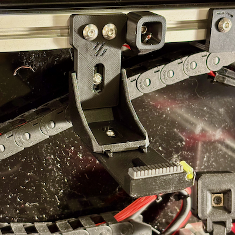
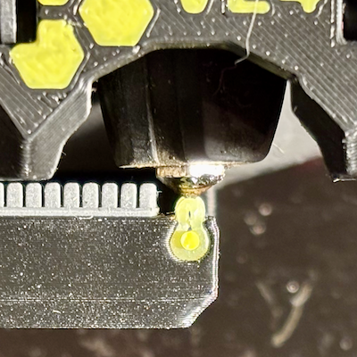

# *** Work in progress ***  Blobifier Modifications

## Description

This is a work in progress and dumping ground for sharing Blobifier modifications to support left and right hand Voron v2.4 installation and prototypes of silicon gantry and fixed nozzle wipe / rest options. 
The gantry Wipe / Rest redesign is derived and based on the excellent work @igannakas (Discord) has pioneered to eliminate colour contamination when changing / purging filaments during mmu prints. 

## Design Goals

- **Gantry & Static Nozzle Wipe Rest**.

  Redesign to incorporate:
  - Dovetail sliders to make it easier to adjust, reduce mounting hardware and improve rigidity **(DONE)**
  - Internal mount and arm voids to improve rigidity - 0.1mm 2x voids (flex is inherent in designs like this and need it as rigid as possible to cap and prevent nozzle ooze) **(DONE)**
  - More material to secure m3 heat sets **(DONE)**
  - A1 Mini silicon wiper block. While easier to secure and replace, its smaller and has shorter, more closely spaced knobs than the original Bambu A1 wiper (zig zag pattern may overcome size limitation) **(DONE - Discarded in preference to chunker, full size Bambu A1 wiper)**
  - Experiment with high temp silicon tubing as nozzle rest with filament pin to secure (Dubro aero/heli silicon fuel tubing - 180c-ish temp) **(DONE - Discarded due to ABS softening after prolonged exposure to 255c+ nozzle temp)** 
  - Evaluate 250c silicon syringe and hole plugs from aliexpress as alternatives. Interestingly "most" silicon HE socks are only rated to 280c **(NOT REQUIRED Silicon button is fine with 3mm/4mm ID/OD PTFE tube sleeve)**
  - Additional options to detach filament klingons / blobs before final wipe (e.g. double silicon rest, angled edge and cutaways on mount, etc)  **(DONE - Discarded in preference to chunker, full size Bambu A1 wiper)**
  - Redesign and experiment with static wipe rest that extends over Blobifier tray to maximise print area. **(DONE)** 
 
- **Blobifier**
  - Ambidextrous move logic to handle left and right hand installation (optimise moves based on install orientation e.g. towards and away from Blobifier)  **(DONE)**
  - Incorporate additional maximum print area bounds checking where it makes sense 
  - Implement Zig zag wiper motion to improve wipe efficacy  **(DONE)** - Maybe consider 3rd combo zig zag & swipe option (40/60 rounded ratio so 3 = 1 zigzag, 2 wipes, 4 = 2 zigzags, 2 wipes)
  - Customisable nozzle shake option to help detach belligerent blobs (default: off)  **(DONE)**
  - Customizable tray iterations to help detach belligerent blobs (default: 1)  **(DONE)**
  - Move servo dwell setting to main Blobifier configuration block  **(DONE)**
  - Zero and restore PA before / after purging  **(DONE)**
  - Support chaining of fixed (static) and optional 2.4 gantry mounted nozzle wipe & rest options. Use of one or both options in tandem  **(DONE)**
  - Bucket shaker profile for Yavoth hotend  **(DONE)**
  - Improve depressor pin avoidance logic (base on HH tip cut location and settings if configured) **(DONE)**
  - Klicky dock and handling unexpected attached probe **(DONE)** Wrapper macros provided for klicky users BLOBIFIER_SAFE and BLOBIFIER_SAFE_PARK
  - Convert all speeds from mm/min to mm/sec to be consistent with Happy Hare **(DONE)**
  - Consider park position randomiser (+/- 1.5mm) to prolong rest longevity (moggieuk suggestion)
  - Always extend the tray when descending to home or purge **(DONE)**
  - Retract tray and extend after bucket shake in case blobs are accumulating and getting caught underneath **(DONE)**
  - Switch accels to use max_accels as defined or user provided whichever is the lower as default is to set it well above what most printers can comfortably accomodate without skipping e.g. use shake_accels,printer.configfile.config.printer.max_accel to cap it **(DONE)**
  - Additional sanity checks of user defined parameters - reset to sane values to prevent missadventure and issues if possible
  - Calculate and display slicer bed exclusion settings to prevent placement of parts that would colide with features **(DONE)** // BLOBIFIER: Slicer bed exclusion zone: 265x278, 300x278, 300x310, 265x310
  - Add x safety move if we only have a tray parking option and we are in print1) move out behind shaker and potentially the 2) depressor pin
  - Final QA test RH operation end to end
  - Final QA test LH operation end to end 

- Silicon nozzle rest options (250c rated) 
  - 3.5mm button plug : https://www.aliexpress.com/item/1005006396026960.html?spm=a2g0o.order_list.order_list_main.89.320f1802CbTUYu
  - Syringe cap : https://www.aliexpress.com/item/1005006915852959.html?spm=a2g0o.order_list.order_list_main.83.320f1802CbTUYu

## MK II Gantry Nozzle Wipe Rest

Current design iteration for the 2.4 gantry mounted nozzle wipe rest. Testing silicon 250c button rest with 3mm/4mm ID/OD PTFE tube sleeve to make it easy to install and remove, insulate from surounding ABS and to make it height adjustable (min 9mm PTFE). Zeroed out additional silicon tube rest as it doesnt seem as necessary after switching to the beefier and larger Bambu A1 Nozzle Wipe (the A1 Mini is considerably smaller and has tighter block pattern and more likely to trap filament debris).

**Older silicon tube based rests**

## Yavoth Hotend Shaker Arm

## Voron v2.4 300mm Dimensions

Example dimensions of blobifier with depressor pins for left hand and right hand installs.

## Videos

Unload, EREC cut, load and blob purge end to end process. Optimized moves to take the shortest path as the print head transitions from fixed / static nozzle wipe rest to the gantry.
Zigzag wipe & straight patterns (using same wipe speed and accels for both - might reduce zigzag speed to 60% of normal rather than creating yet-another-parameter).

Testing 250c silicon rest (Ali express) and larger A1 wiper on Gantry

https://github.com/user-attachments/assets/c10b051a-3b67-4b0f-b9cd-7aeb3ea870b0

Earlier macro hack / prototype.

https://github.com/user-attachments/assets/5ee64c5e-efcd-444d-8302-d71aebe47601

## Earlier Gantry Nozzle Wipe Rest Iterations

## Current Printer setup
Voron 2.4 300mm. Klicky PCB dock on the extreme left, z-endstop, blobifier gantry nozzle wipe rest (needs to be move closer to Blobifier once design/modifications are finalised), Blobifier on right, EREC (no toolhead cutter or depressor pin), and Yavoth hotend.

## Nozzle Tip Temperature Metrics
Measurements for external nozzle tip temperatures taken from 300c - 240c, started at 300c and dropping to lower temps.  Measured with multimeter and thermocouple between silicon reset and nozzle tip.  
External nozzle tip temperatures consistently 40c or so below actual HE temperature target.

