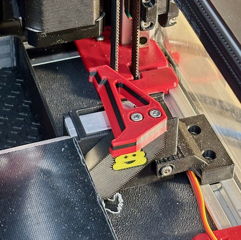
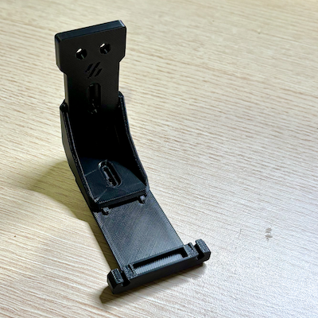
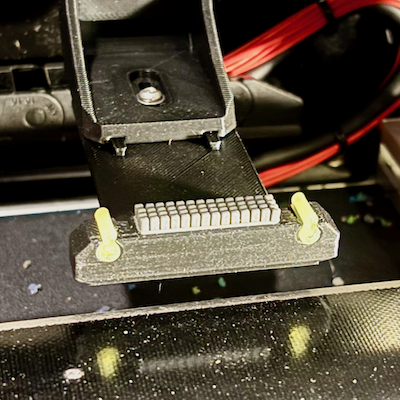
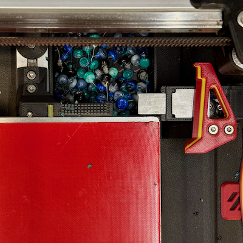

# *** Work in progress ***  Blobifier Modifications

## Description

This is a dumping ground for sharing Blobifier modifications to support left and right hand Voron v2.4 installation and prototypes of silicon gantry and fixed nozzle wipe / rest options. 
The gantry Wipe / Rest redesign is derived and based on the excellent work @igannakas (Discord) pioneered to eliminate colour contamination when changing / purging filaments during mmu prints (https://www.printables.com/model/882364-adjustable-gantry-mounted-nozzle-seal-parking-and). 

## **Gantry & Static Nozzle Wipe Rest**

  Redesign to incorporate:
  - [x] Dovetail sliders to make it easy to adjust, reduce mounting hardware (2 x SHCS/BHCS M3 8mm & 2 x M3 Heatsets) and improve rigidity
  - [x] Internal mount and arm voids to improve rigidity - 0.1mm 2x voids in arm &  mount (flex is inherent in designs like this and need it to be as rigid as possible to cap and prevent ooze)
  - [x] More material depth to secure m3 heat sets
  - [x] A1 Mini silicon wiper block Vs A1. While easier to secure and replace, the A1 Mini wiper is smaller and has shorter, more closely spaced knobs than the original Bambu A1 wiper and was more likely to trap filament debris during testing
        **(Bambu A1 wiper for the win!)**
  - [x] Experiment with high temp silicon tubing nozzle rests secured with filament pin (Dubro aero/heli silicon fuel tubing - 180c-ish.
        Tested and discarded due to ABS mount softening after prolonged exposure to 255c+ parked nozzle.  
  - [x] Evaluate 250c silicon hole plugs and syringe caps from aliexpress as alternatives. Interestingly "most" silicon HE socks are only rated to 280c.
        Silicon hole plug worked exceptionally well in conjunction with 3mm/4mm ID/OD PTFE tube sleeve for mounting, replacing and adjusting rest height. Silicon syringe caps were larger, and more difficult to install and work around. 
  - [x] Trial additional options to help detach blobs before final wipe (e.g. double silicon rest, angled edge, cutaways on top of mount, etc).
        Discarded in preference to chunker, full size Bambu A1 wiper
  - [x] Redesign and experiment with static wiper/rest that extends over Blobifier tray to maximise print area.
        Works well although blobs do tend to pile up more between the static wiper and blobifier base than with the normal static wiper option.  Still managed to fill the tray (400 blobs) but did need to slightly increase shake frequency.
        Also changed Blobifier macro shaker logic to retract the tray before shaking the bucket and extending it afterwards to help release any blobs that may have gotten trapped under the tray.
  - [x] Bucket shaker profile for Yavoth hotend
  - [ ] Test minimal Yavoth shaker arm profile needed to shake bucket effectively while lowering collision profile with chamfered leading edge  
 
## **Blobifier To do's**
  - [x] Re add validation check for static wiper height - +/- 5mm of tray_top
  - [x] Check HH sync config and enable sync during blobbing if necessary (HH should remember the state)
  - [x] Selectable chained wiper height option to control when both wipers are used if fitted.  E.g. gantry wiper only until pos.z > 50mm (or other suitable threshold) before both are used (need to print much higher mmu parts to quantify benefits of chained wipers at altitude)
  - [x] Write info message when heating to minimum blob temp 
  - [ ] Consider post blobing parking moves for toolheads with beacon/carto probes e.g. clear x before y & restore. Trying to park up is the goal and only clear x during print although we might require HH changes to create post pause exit we can hook into to manouver around obsticales like high blobifier or static wiper setups and restoring to a position near blobifier, the shaker or the rear depressor pin  
  - [ ] Handle clearance moves if blobifier or static probe are 1+mm above the bed.  Increase slicer exclusion zone (+toolhead_y as minimum, possibly depressor pin as well) & review moves for all park options to to ensure toolhead doesnt crash into blobifier when restore location is close. Also need to make sure the shaker is avoided when moving to and restoring from blobifier's last x position
  - [ ] QA test RH operation end to end
  - [ ] QA test LH operation end to end 

## Detailed Change Summary
|**Parameter**|**Status**|**Comment**
|-|-|-
|variable_brush_top | Deprecated | Replaced by variable_static_wiper config list
|variable_wipe_qty | Deprecated | Replaced by variable_static_wiper & variable_gantry_wiper config list
|variable_brush_accel | Renamed | variable_wipe_accel
|variable_brush_start | Deprecated | Replaced by variable_static_wiper & variable_gantry_wiper config list
|variable_brush_width| Deprecated | Replaced by variable_static_wiper & variable_gantry_wiper config list
|variable_static_park | New | Static park config - x from left, park height
|variable_static_wiper | New | Static wiper config list - x from left, wiper width, wiper height, wipe pattern, iterations
|variable_gantry_park | New | Gantry park config - x from left
|variable_gantry_wiper | New | Gantry wiper config list - x from left, wiper width, wipe pattern, iterations
|variable_dwell_time | Exposed | User definable servo dwell time
|variable_nozzle_shaker| New | Nozzle / toolhead shaker to detach blobs -x move distance away form ``purge_x``, iterations
|variable_tray_iterations | New | Iterations to retract and extend the tray to help detach blobs
|variable_orientation | New (Internal)|Reflects Blobifier orientation to optimise moves (set based on ``purge_x`` location) - 0 LH, 1 RH
|variable_macro_auth | New (Internal) | Ephemeral random number to restrict console/user access to certain macros

- Klicky entry macros to check if Klicky probe is unexpectedly attached prior to avoid colliding with Blobifier gantry wiper/rest if defined. Checks and bypasses blobbing and parking functions if the probe is attached and doesn’t try to manoeuvre out from behind the gantry wiper/rest to dock the probe. Might call out to pause if mmu_status is in print to manually correct. Macros are conditional on Klicky macros and configuration being loaded & defined. (``BLOBIFIER_SAFE_PARK`` & ``BLOBIFIER_SAFE``)
- Refactored parking and blobbing macros to enable ambidextrous motion for left and right hand Blobifier configurations.  Macro variable "orientation" is automatically set to 0 (LH) or 1 (RH) based on ``purge_x`` location. Travel and wipe/parking moves as well as depressor pin avoidance are optimised based on this setting.
- Parking motion will always attempt to swipe through the nearest wiper to maximise the cleaning oppertunity when parking.    
- 3 wiper patterns to improve wipe efficacy. ``0:`` normal swipe, ``1:`` zigzag (away from y), ``2:`` combo zigzag/swipe action. When combo is selected a 40/60 ratio of zigzag/swipe is applied with a minimum of 1 complete wipe for each option. e.g. wipes: 3 will result in 1 zigzag & 2 swipes, Wipes: 4 2 zigzags, 2 swipes. Zigzag is speed capped @ 500mm/s to reduce vibration or potential printer damage given users can increase accels well above the upper printer ``max_accel`` limit. Depending on the location of the nozzle rest, an additional 1/2 wipe will be added in some circumstances to end near the designated park or transition point
- Add simple user definable nozzle shaker option to help detach belligerent blobs after blobbing and before moving to wiper
- Add simple user definable option to retract and extend the tray n-times to help detach belligerent blobs (default: 1)
- Always extend the tray before descending to park / purge to reduce the risk of colliding with it or damaging the nozzle if the tray height is set too low
- Retract the tray before shaking the bucket to disperse blobs in case they have accumulated or are trapped underneath it
- Convert all Blobifier speeds from mm/min to mm/sec to be consistent with Happy Hare settings
- Add conditional depressor pin avoidance logic for LH configurations.  Will move print head inboard if toolhead is in front of depressor pin and ``form_tip_macro`` is set to ``'_MMU_CUT_TIP'`` and ``gantry_servo_enabled`` is false. Moves a max of 80mm or ``toolhead_x + tc.pin_loc_xy[0] + tc.pin_park_dist`` width. Y axis cutter ignored and will need to review if/when RH cutter toolheads become available 
- Move servo dwell setting up into Blobifier macro block to make user configurable
- Wrap blob/purge logic to zero and restore ``Pressure Advance`` setting
- Removed redundant save and other variables where possible.  Overridden printer speed/accel settings are now restored using orginal jinga printer variable values as the values are unchanged after the macro is called
- Support chaining of static and gantry nozzle wipe & rest options. All options are "optional" and will use whatever is available.  Prioritise parking on gantry, static locations before falling back to the tray
- Add separate config variables (list) for independent management of static and gantry wipe and nozzle rest options.  Make use conditional according to defined features e.g. rest only, wiper only, wiper/rest combo, static, gantry, etc
- Add wipe and optimised move logic to chain static -> gantry wipe and park locations based on whats configured  
- Update safe descent logic check for RH configuration. Make static wiper/rest avoidance conditional on it being defined and enabled
- Add additional configuration validation and overrides
  - ``purge_x`` needs to be within 15mm of min|max printer dimensions depending on orientation
  - cap skew_correction at 1.0mm max to avoid colliding with bed if Blobifier tray_top is < bed height
  - if shake or wipe user defined accels == 0, override and set to printer max_accel value. Warn if user defined value > printer max_accels (set to -1 to ignore and use current gcode accels)
  - validate static and gantry park/wipe settings. Static park and wiper height must be +/- 5mm of tray_top, undefined wipe width, wipe_action == (0,1,2), park_x cant be in middle of wiper, static parking spot on correct side for orientation (expects parking spot to be to the right of wiper for LH setups and on the left for RH setups)
  - nozzle shaker x <= 5mm from ``purge_x``
  - sensible values entered for toolhead_x & toolhead_y dimensions. Both must be > 25mm
- Calculate and display slicer bed exclusion poloygon on startup for users to paste into their slicer setup to mask print areas that will collide with enabled Blobifier features
  ``// BLOBIFIER: Set you Slicer bed exclusion zone to: 265x278, 300x278, 300x310, 265x310``
- Update operator notifications to consistently use ``action_respond_info`` for writing info/progress messages to the console
- Use simple ephemeral random number auth challenge to prevent users from interactively running _BLOBIFIER_WIPER & BLOBIFIER_SHAKE_BUCKET macros interactively from the console (random number set on startup passed to macro to compare)
- Refactor parking logic to prioritise parking options based on what’s configured - 1) gantry park, 2) static park else 3) tray.
  When ``user_park_move_macro`` is set to ``'BLOBIFIER_PARK'|'BLOBIFIER_SAFE_PARK' in Happy Hare, xyz arguments passed are currently ignored (might need to reconsider this if gantry park not configured.
- Update overview section, headings, parameter usage and inline comments

 
 
  
## Silicon nozzle rest options (250c rated) 
  - **3.5mm button plug : https://www.aliexpress.com/item/1005006396026960.html?spm=a2g0o.order_list.order_list_main.89.320f1802CbTUYu (RECOMMENDED OPTION)**
  - Syringe cap : https://www.aliexpress.com/item/1005006915852959.html?spm=a2g0o.order_list.order_list_main.83.320f1802CbTUYu

## MK II Gantry Nozzle Wipe Rest

Current design iteration for the 2.4 gantry mounted nozzle wipe rest. Silicon 250c button rest with 3mm/4mm ID/OD PTFE tube sleeve to make it easy to install and remove, insulate from surounding ABS and to make it height adjustable (min 7mm PTFE). Zeroed out additional silicon tube rest(s) as they don't seem necessary after switching to the beefier and larger Bambu A1 Nozzle Wipe (the A1 Mini is considerably smaller with tighter block pattern and is more likely to trap filament debris).

**Wear and Tear** This is after > 1500 changes and parking the nozzle up @ 290c for 45mins.  The over temp dimple helps cap the nozzle but expect the silicon rest to deterorate further over time especially if the nozzle is left in a parked state at high temp for prolonged periods of time. No noticable wear and tear parking up while preheating or during printing and filament changes with default Happy Hare 5-minute HE timeout and 255c target temp.  As the silicon rest is only rated @ 250c and easily replacable, it should be considered "consumable" and replaced as often as needed when its no longer able to restrict oozing.  Even though external nozzle temp measurements appeared to be 40-50c lower than target HE temps, if left sitting on the rest for prelonged periods (e.g. > 10mins), tip temp will gradually creep up, reducing the temp delta. 

Unless a higher temp option can be sourced from aliexpress, this is one of the best options Ive identified.  

**Video of right hand blob action with nozzle shake, cascading wipe (combo zigzag & straight motion - Option:2) from static wiper through to gantry wiper and final park up**

https://github.com/user-attachments/assets/15b4801e-78ad-42de-9327-dc3350addd9f

**Slicer excluded bed region**

## Voron v2.4 300mm Reference Dimensions

Reference dimensions of blobifier with depressor pins for left hand and right hand installs on a 300mm Voron 2.4.

## Yavoth Hotend Shaker Arm

## Current Printer setup
Voron 2.4 300mm. Klicky PCB dock on the extreme left, z-endstop, blobifier gantry nozzle wipe rest (needs to be move closer to Blobifier once design/modifications are finalised), Blobifier on right, EREC (no toolhead cutter or depressor pin), and Yavoth hotend. Blobifier tray 1.2mm above bed.

## Nozzle Tip Temperature Metrics
Measurements for external nozzle tip temperatures taken from 300c - 240c, started at 300c, waiting for 5mins and dropping to lower temps.  Measured with multimeter and thermocouple between silicon reset and nozzle tip.  
External nozzle tip temperatures consistently 40c or so below actual HE temperature target.

**Older silicon tube based designs**

