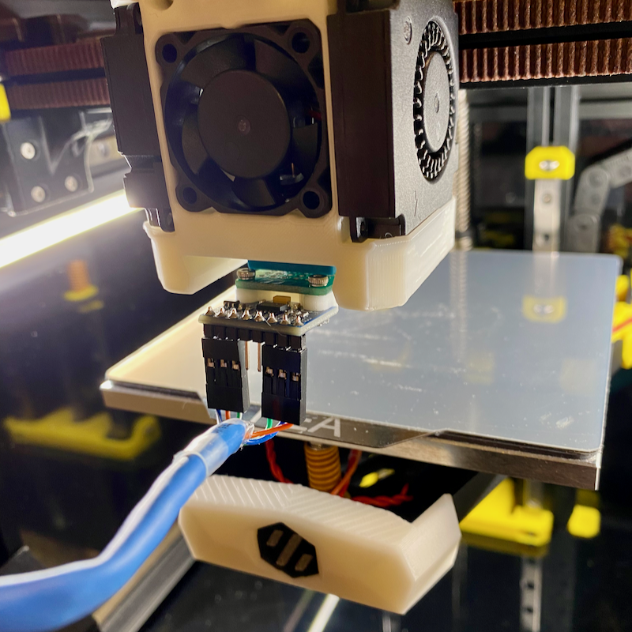
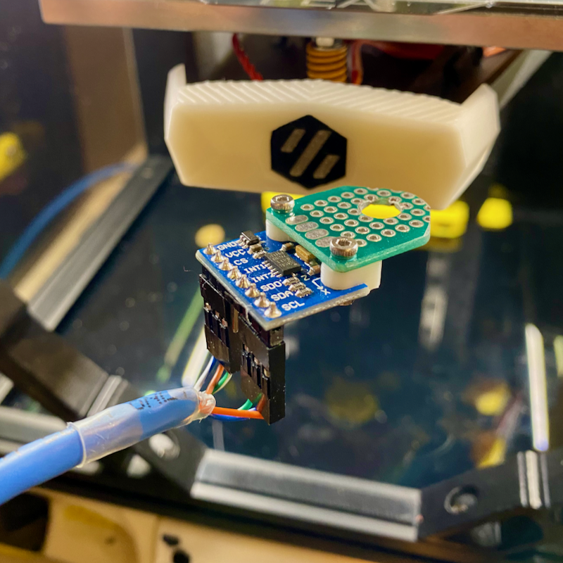

# v0.2 ADXL Nozzle Mount

## Description

I'm not a fan of the default v0.2r1 ADXL mount that attaches to the back of the x-carriage.  It's really fiddly and difficult to fit and interferes with homing if still attached and thought I would whip up a direct, attach nozzle mount.
Close and securely attached to the nozzle is best and is pretty easy to make assuming you have some fibre glass prototyping board and a Dremel or small hacksaw to cut and shape it and some drills.  

The fibre glass is more rigid and will wear much better than a full printed part.

Since the molex connector had already been soldered to the ADXL for fitting to the back of the x-carriage, I needed to drop the bed to provide a little more clearance for the cable.

Currently using the following settings (accel_per_hz increased to generate a little more energy):
```
[resonance_tester]
accel_chip: adxl345
probe_points:         60,60,25   ; drop bed lower for cables
accel_per_hz:         100        ; generate more energy [default 75]
hz_per_sec:           0.5
```
 
Orientation of ADXL. Note this isnt actually attached to the nozzle in this photo and need to 
heat the hotend to remove the nozzle (and sock). 

Make sure you let it cool before mounting the ADXL board though :-) <br><br>


<br><br>



## Change Log

* Published
