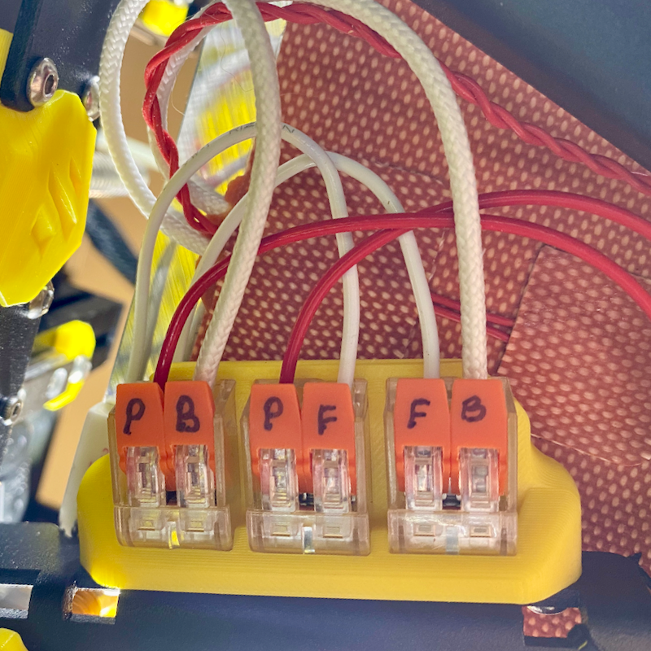

# v0.2 Aliexpress Clone Wago 221-412 Kirigami Mount

## Description

Remixed / modified Kirigami wago mount from [Christoph Mueller](https://github.com/christophmuellerorg/voron_0_kirigami_bed) to support cheap & cheerful Wago 221-412 2-way clones available from Aliexpress.
These don't have the usual side nubs to secure them when clipped in and are also slightly wider than genuine wagos.  Nubs added to the front left of each block to retain them and slots widened.  
The fit is deliberately tight to prevent them from popping out when opening the levers to remove the bed.  Adjust as needed.

Mounts to Kirigami bed facing down to allow connectors to be opened from below and bed removed. 

## Change Log

* Published
