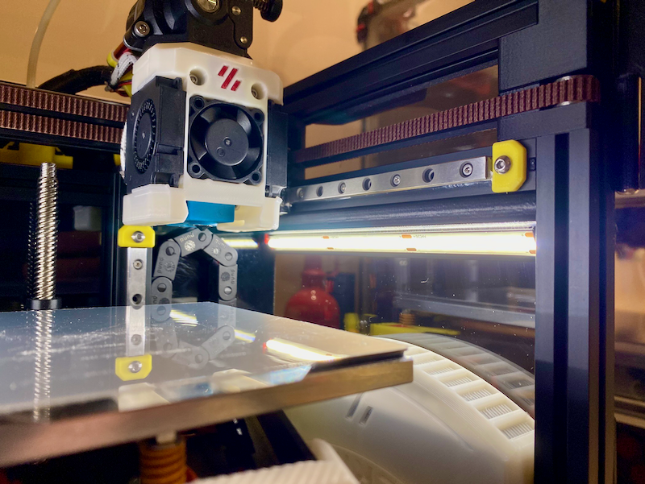

# v0.2r1 COB LED Press Fit Mount

## Description

Quick remix (hack) using Tinkercad of @RichardM's exellent https://www.printables.com/model/172405-clip-in-led-mounts-for-voron-0-1515-extrusion 1515 LED mounts to change the profile to allow me to attach self-adhesive 24v COB LED light strips (natural white 4000k, 480 LEDS/metre).
I use COB lights for all my printers as they are simple, get the job done, PMW well, and have built in diffusers so don’t take up much space.  I PMW cap them at 60% power and run them at 40% when printing which is plenty bright enough.  In hindsight, 384 LEDS/metre would provide ample illumination for printer use. I have two short strips mounted under each Y rail.  Since I have no interest in servo mounted options at this stage for the v0.2 this keeps them well out of the way and means I dont have to faff around wiring up 5v nozzle sequin LEDs on the hotend as they throw sufficient light to see whats going on.  

@RicharM 1515 mounts are really elegant and are the best press fit channel mounts I have seen.  They use sets of 3, alternating interlocking fingers that snap into the 1515 channels and hold on super tight - all credit for the excellent design to https://www.printables.com/@RichardM. 

## Change Log

* Published
