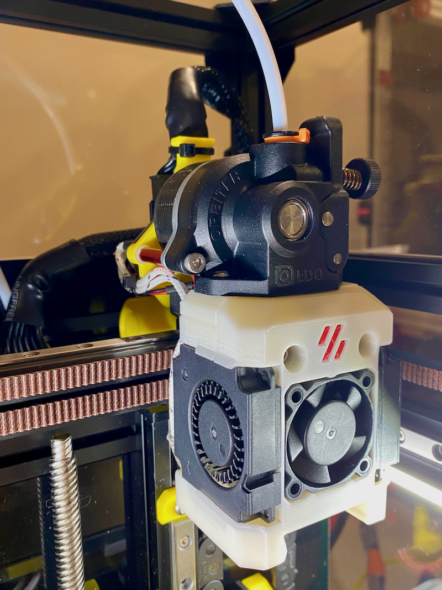

# v0.2 Dragon Burner Orbitor 2.0 Umbilical Toolhead Mount

## Description

Remixed the VoronDesign v0.2r1 umbilical toolhead mount for Orbiter 2.0 and Dragon Burner hotend. The mount is offset and screws to standoffs attached to Orbiter motor mount screws.
Umbilical board and cable tie points relocated to suit offset layout and v0.2r1 x-carriage and Orbiter mount points.

## Change Log

* Published
