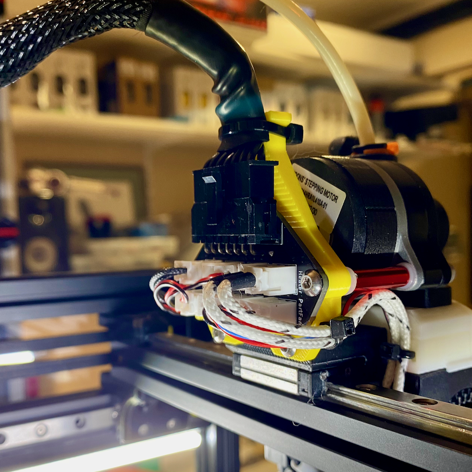

# v0.2 Dragon Burner Orbitor 2.0 Umbilical Toolhead Mount

## Description

Remix of the VoronDesign v0.2 umbilical toolhead mount for Orbiter 2.0 and Dragon Burner hotend. The mount is offset slightly from stock and screws to the back of the x-carriage and standoffs attached to the Orbiter motor mount m3's.
Umbilical board and zip tie points relocated given offset layout and v0.2 x-carriage and Orbiter mounts.

Umbilical circuit board mounts using m3 into plastic (self-tap) on one side and through hole m3 to threaded standoff on other side.

   

## Change Log

* Published
