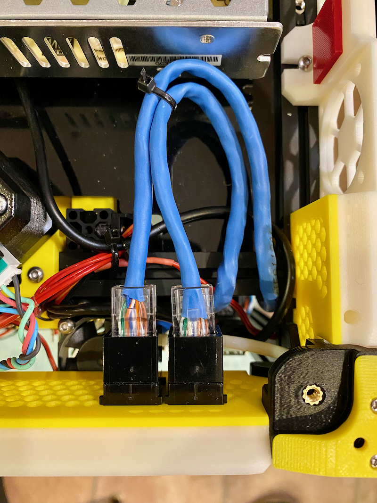

# v0.2 Stealth Skirts Rear Panel Keystones

## Description

Remixed and modified rear Stealth Skirts panel for v0.2 with dual keystone ports for RJ45 joiners for RPi Ethernet and Input Shaper ports.

  
Unfortunately this symetrical orientation didnt allow enought room to clear the Z Stepper with RJ45 keystone joiner and plug/cable so needed to
change the layout :-(   

## Change Log

* Published
