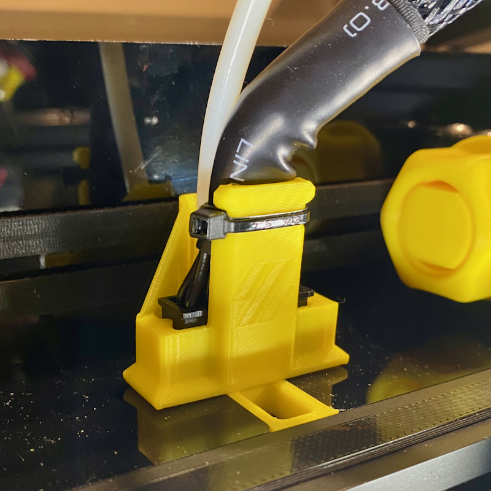

# v0.2r1 Sturdy PTFE & Umbilical Strain Relief

## Description

Remix and more sturdy version of the VoronDesign v0.2 Umbilical PTFE strain relief with cable tie and riser to secure the umbilical cable as well to minimise motion load on its connector and pins.
Beefed up with extended footprint to handle extra load from umbilical cable.

## Change Log

* Published
